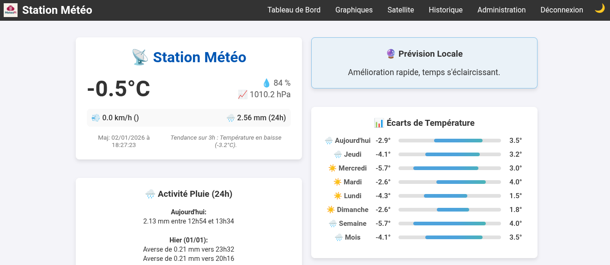

<p align="center">
  
</p>

# Raspberry Pi Weather Station

A complete weather station project based on Raspberry Pi, featuring local sensor data collection, a web dashboard with historical graphs, and satellite imagery integration.

<p align="center">
  
</p>

> **Note:** This project is currently in the **development stage**.

## 🌟 Features

*   **Real-time Monitoring**: Measures Temperature, Humidity, Pressure, Rainfall, Wind Speed, and Wind Direction.
*   **Web Dashboard**: A Flask-based web interface to view current conditions and historical data.
*   **Data Visualization**:
    *   Interactive graphs for the last 48 hours (Temperature, Humidity, Pressure, Rain).
    *   Wind Rose for wind direction analysis.
    *   Daily rain accumulation charts.
    *   Min/Max statistics (Day, Week, Month).
*   **Satellite Imagery**: Automatically fetches and animates cloud cover maps from OpenWeatherMap.
*   **LCD Display**: Local display of current metrics on a Grove RGB LCD with color-coded background based on temperature.
*   **Home Assistant Integration**: Provides a JSON API endpoint (`/api/v1/sensors`) for external integration.
*   **Robust Logging**: Data is logged to CSV with automatic corruption recovery.

## 🛠 Hardware Requirements

*   **Raspberry Pi** (any model with GPIO and I2C support)
*   **Sensors**:
    *   **BME280** (I2C, 0x76): Primary Temperature, Humidity, and Pressure sensor.
    *   **DHT11** (GPIO 4): Backup Temperature/Humidity sensor.
    *   **AS5600** (I2C): Magnetic Rotary Position Sensor for the Wind Vane.
    *   **Rain Gauge** (GPIO 5): Tipping bucket mechanism.
    *   **Anemometer** (GPIO 6): Pulse-based wind speed sensor.
*   **Display**: Grove RGB LCD (I2C).

### 🖨 3D Printed Parts Sources
This project incorporates existing designs from Thingiverse for the mechanical components:
*   **Rain Gauge**: [Thingiverse #4725413](https://www.thingiverse.com/thing:4725413)
*   **Anemometer (Wind Speed)**: [Thingiverse #2559929](https://www.thingiverse.com/thing:2559929)

## 🔌 Wiring

| Component | Interface | Pin / Address |
| :--- | :--- | :--- |
| **BME280** | I2C | 0x76 |
| **AS5600** | I2C | Default |
| **LCD** | I2C | 0x3e, 0x62 |
| **DHT11** | GPIO | GPIO 4 |
| **Rain Gauge** | GPIO | GPIO 5 |
| **Anemometer** | GPIO | GPIO 6 |

## 📦 Installation

1.  **Clone the repository**:
    ```bash
    git clone https://github.com/gotenash/meteopi.git
    cd meteopi
    ```

2.  **Install Python dependencies**:
    ```bash
    pip3 install flask flask-login pandas matplotlib numpy requests smbus2 adafruit-circuitpython-dht adafruit-circuitpython-bme280 adafruit-circuitpython-as5600 gpiozero pillow
    ```
    *Note: Ensure I2C is enabled on your Raspberry Pi via `raspi-config`.*

3.  **Configuration**:
    The system uses a `config.json` file. It will be created automatically on the first run of the web app, or you can create it manually:
    ```json
    {
        "owm_api_key": "YOUR_OPENWEATHERMAP_API_KEY",
        "latitude": 48.85,
        "longitude": 2.35
    }
    ```

## 🚀 Usage

The system consists of three main scripts that should run simultaneously (e.g., via `systemd` or `crontab`).

### 1. Sensor Data Collection
Starts reading sensors and logging data to `meteo_log.csv`.
```bash
python3 meteo_capteur.py
```

### 2. Web Interface
Starts the Flask web server (default port 5000).
```bash
python3 meteo_web.py
```
Access the dashboard at `http://<raspberry-pi-ip>:5000`.
*   **Default Login**: `admin` / `password` (Change this in `meteo_web.py`!)

### 3. Satellite Image Fetcher
Downloads cloud maps every 15 minutes.
```bash
python3 satellite_fetcher.py
```

## 📊 API

You can retrieve the latest sensor data in JSON format for integration with Home Assistant or other systems:

**Endpoint**: `GET /api/v1/sensors`

**Response**:
```json
{
  "humidity": 45.0,
  "last_update": "2023-10-27T14:30:00",
  "pressure": 1015.2,
  "rain": 0.0,
  "temperature": 22.5,
  "wind_direction": "NE",
  "wind_speed": 12.4
}
```
