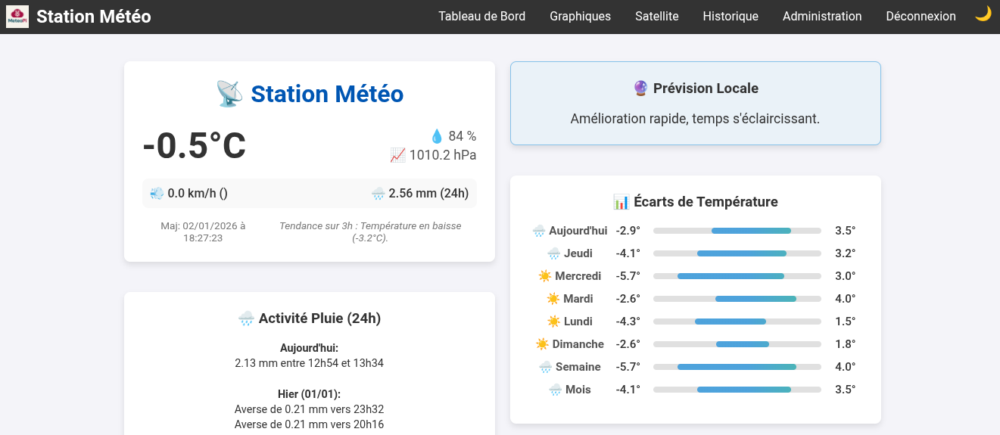

<p align="center">
  
</p>

# Raspberry Pi Weather Station (MeteoPi)

A complete, robust, and autonomous weather station project based on Raspberry Pi. It features local sensor data collection, an animated satellite weather radar, a full-featured web dashboard with historical graphs, administrative tooling, and MQTT/InfluxDB/Telegram integrations.

<p align="center">
  
</p>

> **Note:** This project is in active development and optimization.

---

## 🌟 Key Features

*   **Real-time Sensor Monitoring**: Captures temperature, humidity, atmospheric pressure, rainfall accumulation, wind speed, wind gust speed, and wind direction.
*   **Web Dashboard**: A Flask-based web interface to monitor current conditions, inspect historical records, and manage the system.
*   **Data Visualization**:
    *   Interactive plots showing conditions over the last 48 hours (Temperature, Humidity, Pressure, Rain).
    *   Interactive Wind Rose for wind direction analysis.
    *   Hourly and daily rain accumulation charts.
    *   Min/Max statistics calculated for Day, Week, and Month.
*   **SD Card Wear Mitigation (Persistence)**: System data is logged to a RAM-based directory (`data/`) and automatically synced to the SD card (`data_persistent/`) upon startup/shutdown and backup tasks to prolong Raspberry Pi SD card life.
*   **Automated Samba Network Backups**: An automated systemd timer backing up datasets (`meteo_log.csv`, `wind_detail_log.csv`) and configurations (`config.json`) daily to a network share (SMB/Samba).
*   **Satellite Weather Animation**: Downloads cloud cover tiles from the OpenWeatherMap API, stitches them into a 3x3 grid, and generates dynamic animated overlays.
*   **Local LCD Display**: Shows real-time metrics on a Grove RGB LCD with a temperature-reactive background color.
*   **Integrations**:
    *   **MQTT**: Publishes real-time sensor payloads to a broker for smart home consumption.
    *   **InfluxDB**: Sends metrics directly to InfluxDB for custom Grafana dashboards.
    *   **Telegram Bot**: Periodically transmits detailed weather reports to a Telegram group/chat.
    *   **Home Assistant API**: Exposes a standard JSON API endpoint (`/api/v1/sensors`).
*   **Interactive History Manager**: Web-based administration panel allowing users to inspect, modify, and delete historical weather records.

---

## 🛠 Hardware Requirements

*   **Raspberry Pi** (any model with GPIO and I2C support; optimized for Raspberry Pi OS Bookworm)
*   **Sensors**:
    *   **BME280** (I2C, address `0x76`): Primary temperature, humidity, and atmospheric pressure.
    *   **DHT11** (GPIO 4): Backup temperature and humidity sensor.
    *   **AS5600** (I2C): Magnetic rotary encoder to track wind vane direction.
    *   **Rain Gauge / Pluviometer** (GPIO 5): Tipping bucket mechanism (calibrated to `0.213 mm` per tip).
    *   **Anemometer** (GPIO 6): Hall-effect wind speed sensor.
    *   **LCD Button** (GPIO 26): Tactile button to toggle display modes on the LCD screen.
*   **Display**: Grove RGB LCD (I2C, addresses `0x3e` & `0x62`).

### 🖨 3D Printed Parts Sources
Mechanical designs sourced from Thingiverse:
*   **Rain Gauge**: [Thingiverse #4725413](https://www.thingiverse.com/thing:4725413)
*   **Anemometer (Wind Speed)**: [Thingiverse #2559929](https://www.thingiverse.com/thing:2559929)

---

## 🔌 Wiring Diagram

| Component | Interface | Pin / Address | Details |
| :--- | :--- | :--- | :--- |
| **BME280** | I2C | `0x76` | SCL/SDA, 3.3V, GND |
| **AS5600** | I2C | `0x36` (Default) | Wind Vane Direction |
| **Grove LCD** | I2C | `0x3e` (LCD), `0x62` (RGB) | Character Display |
| **DHT11** | GPIO | `GPIO 4` | Backup Sensor |
| **Rain Gauge** | GPIO | `GPIO 5` | Tipping Bucket Signal |
| **Anemometer** | GPIO | `GPIO 6` | Wind Speed Pulses |
| **LCD Button** | GPIO | `GPIO 26` | Change LCD Display Mode |

---

## 📦 Automated Installation

The project includes a comprehensive installer (`setup.sh`) which automates APT package installations, system configuration, user groups, Gunicorn/Nginx, and systemd services.

1.  **Clone the Repository**:
    ```bash
    git clone https://github.com/gotenash/meteopi.git
    cd meteopi
    ```

2.  **Run the Setup Script**:
    ```bash
    sudo ./setup.sh
    ```
    This script will:
    *   Configure APT package repositories and install system packages (`python3`, `git`, `i2c-tools`, `nginx`, `cifs-utils`).
    *   Enable the I2C bus in `/boot/config.txt`.
    *   Create a virtual environment (`venv`) and install Python packages.
    *   Set up Nginx as a reverse proxy forwarding requests to Gunicorn.
    *   Install and launch the systemd service daemons.

3.  **Restart the Raspberry Pi**:
    ```bash
    sudo reboot
    ```

---

## 🚀 Services & Scripts Reference

### Core Services (managed via `systemd`)

*   **Sensor Collection Daemon (`meteo-capteur.service`)**:
    Runs [meteo_capteur.py](file:///c:/Users/ash/Documents/GitHub/meteopi/meteo_capteur.py). Collects data every minute, writes to `data/meteo_log.csv`, controls the LCD, and publishes to MQTT/InfluxDB.
*   **Web Server (`meteo-web.service`)**:
    Runs [meteo_web.py](file:///c:/Users/ash/Documents/GitHub/meteopi/meteo_web.py) via Gunicorn. Serving the web dashboard on port 80.
*   **Satellite Fetcher (`satellite-fetcher.service`)**:
    Runs [satellite_fetcher.py](file:///c:/Users/ash/Documents/GitHub/meteopi/satellite_fetcher.py). Stitches openweathermap cloud cover maps every 15 minutes.
*   **Telegram Bot (`telegram-bot.service`)**:
    Runs [telegram_bot.py](file:///c:/Users/ash/Documents/GitHub/meteopi/telegram_bot.py). Sends hourly reports to your Telegram chat.
*   **Data Persistence (`meteo-persistence.service`)**:
    Restores the logged files from the SD card to the RAM disk at boot, and flushes them back on shutdown to prevent storage corruption and excessive write cycles.
*   **Samba Backup Timer (`meteo-backup.timer`)**:
    Runs the backup service daily at `03:00` using [backup_samba.sh](file:///c:/Users/ash/Documents/GitHub/meteopi/backup_samba.sh).

### Utility & Diagnostic Scripts

*   [reset_password.py](file:///c:/Users/ash/Documents/GitHub/meteopi/reset_password.py): Command Line Interface to reset the web admin dashboard password.
    ```bash
    ./venv/bin/python reset_password.py
    ```
*   [reparer_csv.py](file:///c:/Users/ash/Documents/GitHub/meteopi/reparer_csv.py): Migrates and repairs older 7-column CSV log files to the newer 8-column format (adding the `wind_gust` field).
*   [convertisseur_csv.py](file:///c:/Users/ash/Documents/GitHub/meteopi/convertisseur_csv.py): Replaces decimal commas with dots inside data files to correct plot-rendering issues.
*   [test_pluviometre.py](file:///c:/Users/ash/Documents/GitHub/meteopi/test_pluviometre.py): Tests rain gauge tipping pulses on `GPIO 5`.
*   [test_anemometre.py](file:///c:/Users/ash/Documents/GitHub/meteopi/test_anemometre.py): Diagnoses wind speed magnet sweeps on `GPIO 6`.
*   [test_anemometre_lcd.py](file:///c:/Users/ash/Documents/GitHub/meteopi/test_anemometre_lcd.py): Real-time speedometer displaying the speed directly on the Grove LCD.

---

## ⚙️ Configuration File (`config.json`)

The system configuration is kept in `config.json`. Below are all the parameters that can be adjusted manually or through the Web Admin dashboard:

```json
{
    "owm_api_key": "YOUR_OPENWEATHERMAP_API_KEY",
    "latitude": 48.85,
    "longitude": 2.35,
    "admin_password_hash": "pbkdf2:sha256:...",
    "telegram_bot_token": "YOUR_TELEGRAM_BOT_TOKEN",
    "telegram_chat_id": "YOUR_TELEGRAM_CHAT_ID",
    "samba_share": "//192.168.1.100/WeatherBackups",
    "samba_user": "nas_user",
    "samba_password": "nas_password",
    "mqtt_enabled": true,
    "mqtt_broker": "192.168.1.50",
    "mqtt_port": 1883,
    "mqtt_user": "mqtt_user",
    "mqtt_password": "mqtt_password",
    "mqtt_topic": "meteopi/sensors",
    "influx_enabled": false,
    "influx_url": "http://localhost:8086",
    "influx_token": "YOUR_INFLUXDB_TOKEN",
    "influx_org": "my_org",
    "influx_bucket": "meteopi"
}
```

---

## 📊 API & Data Format

### JSON Endpoint
*   **Path**: `GET /api/v1/sensors`
*   **Response Format**:
    ```json
    {
      "humidity": 45.0,
      "last_update": "2026-08-02T14:30:00",
      "pressure": 1015.2,
      "rain": 0.0,
      "temperature": 22.5,
      "wind_direction": "NE",
      "wind_speed": 12.4,
      "wind_gust": 18.2
    }
    ```

### CSV Schema (`meteo_log.csv`)
Logs are saved in `data/meteo_log.csv` with the following 8-column layout:
`[Timestamp, Temperature (°C), Humidity (%), Pressure (hPa), Rain since last (mm), Wind Speed (km/h), Wind Gust (km/h), Wind Direction (str)]`
Example:
```csv
2026-08-02 09:15:00,21.43,58.30,1012.40,0.0000,4.20,7.80,WSW
```