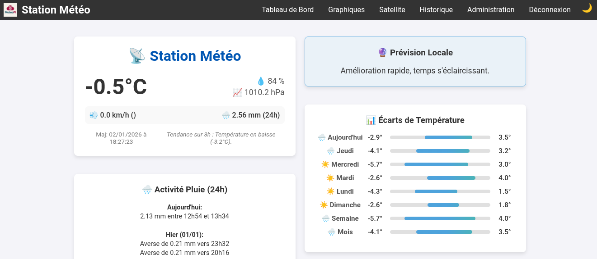

<p align="center">
  
</p>

# Station Météo Raspberry Pi

Un projet complet de station météo basé sur Raspberry Pi, comprenant la collecte locale de données de capteurs, un tableau de bord web avec graphiques historiques et l'intégration d'images satellites.

<p align="center">
  
</p>

> **Note :** Ce projet est actuellement au stade de **développement**.

## 🌟 Fonctionnalités

*   **Surveillance en temps réel** : Mesure la température, l'humidité, la pression, les précipitations, la vitesse et la direction du vent.
*   **Tableau de bord Web** : Une interface web basée sur Flask pour visualiser les conditions actuelles et les données historiques.
*   **Visualisation des données** :
    *   Graphiques interactifs pour les dernières 48 heures (Température, Humidité, Pression, Pluie).
    *   Rose des vents pour l'analyse de la direction du vent.
    *   Graphiques de cumul de pluie journalier.
    *   Statistiques Min/Max (Jour, Semaine, Mois).
*   **Imagerie Satellite** : Récupère et anime automatiquement les cartes de couverture nuageuse depuis OpenWeatherMap.
*   **Notifications Telegram** : Envoi périodique de bulletins météo via un bot Telegram configurable.
*   **Affichage LCD** : Affichage local des mesures actuelles sur un écran LCD Grove RGB avec un fond coloré en fonction de la température.
*   **Intégration Home Assistant** : Fournit un point de terminaison API JSON (`/api/v1/sensors`) pour l'intégration externe.
*   **Journalisation robuste** : Les données sont enregistrées dans un fichier CSV avec récupération automatique en cas de corruption.

## 🛠 Matériel Requis

*   **Raspberry Pi** (tout modèle avec support GPIO et I2C)
*   **Capteurs** :
    *   **BME280** (I2C, 0x76) : Capteur principal de Température, Humidité et Pression.
    *   **DHT11** (GPIO 4) : Capteur de secours Température/Humidité.
    *   **AS5600** (I2C) : Capteur de position angulaire magnétique pour la Girouette.
    *   **Pluviomètre** (GPIO 5) : Mécanisme à auget basculeur.
    *   **Anémomètre** (GPIO 6) : Capteur à effet Hall (3 fils).
    *   **Bouton LCD** (GPIO 26) : Bouton poussoir pour changer l'affichage.
*   **Affichage** : Écran LCD Grove RGB (I2C).

### 🖨 Sources des Pièces Imprimées en 3D
Ce projet intègre des conceptions existantes de Thingiverse pour les composants mécaniques :
*   **Pluviomètre** : Thingiverse #4725413
*   **Anémomètre (Vitesse du vent)** : Thingiverse #2559929

## 🔌 Câblage

| Composant | Interface | Broche / Adresse |
| :--- | :--- | :--- |
| **BME280** | I2C | 0x76 |
| **AS5600** | I2C | Par défaut |
| **LCD** | I2C | 0x3e, 0x62 |
| **DHT11** | GPIO | GPIO 4 |
| **Pluviomètre** | GPIO | GPIO 5 |
| **Anémomètre** | GPIO | GPIO 6 (Signal), VCC, GND |
| **Bouton LCD** | GPIO | GPIO 26 |

## 📦 Installation

1.  **Prérequis : Installer Git**
    Si Git n'est pas installé sur votre Raspberry Pi (surtout sur une nouvelle installation de Raspberry Pi OS Lite), ouvrez un terminal et exécutez :
    ```bash
    sudo apt update && sudo apt install git -y
    ```

1.  **Cloner le dépôt** :
    ```bash
    git clone https://github.com/gotenash/meteopi.git
    cd meteopi
    ```

2.  **Installer les dépendances Python** :
    ```bash
    pip3 install flask flask-login pandas matplotlib numpy requests smbus2 adafruit-circuitpython-dht adafruit-circuitpython-bme280 adafruit-circuitpython-as5600 gpiozero pillow
    ```
    *Note : Assurez-vous que l'I2C est activé sur votre Raspberry Pi via `raspi-config`.*

3.  **Configuration**:
    Le système utilise un fichier `config.json`. Il sera créé automatiquement au premier lancement de l'application web, ou vous pouvez le créer manuellement :
    ```json
    {
        "owm_api_key": "VOTRE_CLE_API_OPENWEATHERMAP",
        "latitude": 48.85,
        "longitude": 2.35,
        "telegram_bot_token": "VOTRE_TOKEN_DE_BOT_TELEGRAM",
        "telegram_chat_id": "VOTRE_CHAT_ID_TELEGRAM"
    }
    ```

## 🚀 Utilisation

Le système se compose de trois scripts principaux qui doivent s'exécuter simultanément (par exemple, via `systemd` ou `crontab`).

### 1. Collecte des Données Capteurs
Commence la lecture des capteurs et l'enregistrement des données dans `meteo_log.csv`.
```bash
python3 meteo_capteur.py
```

### 2. Interface Web
Démarre le serveur web Flask (port 5000 par défaut).
```bash
python3 meteo_web.py
```
Accédez au tableau de bord à l'adresse `http://<ip-raspberry-pi>:5000`.
*   **Connexion par défaut** : `admin` / `password` (Changez-le dans `meteo_web.py` !)

### 3. Récupérateur d'Images Satellites
Télécharge les cartes nuageuses toutes les 15 minutes.
```bash
python3 satellite_fetcher.py
```

## 📊 API

Vous pouvez récupérer les dernières données des capteurs au format JSON pour une intégration avec Home Assistant ou d'autres systèmes :

**Point de terminaison** : `GET /api/v1/sensors`

**Réponse** :
```json
{
  "humidity": 45.0,
  "last_update": "2023-10-27T14:30:00",
  "pressure": 1015.2,
  "rain": 0.0,
  "temperature": 22.5,
  "wind_direction": "NE",
  "wind_speed": 12.4
}
```